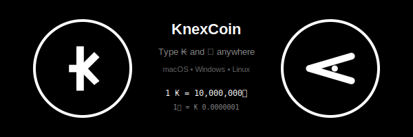
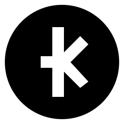
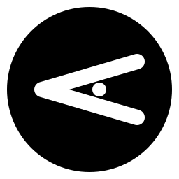

# Special ₭ Symbol KnexCoin Currency Integration

<p align="center">
  
</p>

<p align="center">
  <strong>Type ₭ (KNEX) and ⋖ (RAW) currency symbols anywhere!</strong>
  <br/>
  <em>macOS • Windows • Linux</em>
</p>

<p align="center">
  <a href="#-earn-free-knexcoin">Earn Free ₭</a> •
  <a href="#-knex-crypto-card-ntag-424-dna">Crypto Card</a> •
  <a href="#-quick-install">Quick Install</a> •
  <a href="#-keyboard-shortcuts">Shortcuts</a> •
  <a href="#-troubleshooting">Troubleshooting</a>
</p>

---

## 🎁 Earn Free KnexCoin

**Installing this keyboard integration is one way to earn free KnexCoin!** Rewards are delivered directly to your:

- **KnexWallet** - Mobile or desktop wallet app
- **Knex Crypto Card** - Physical NFC card with NTAG 424 DNA technology

### How to Earn

1. Install the currency symbol integration (this repo)
2. Register your wallet at [knexcoin.org/rewards](https://knexcoin.org/rewards)
3. Receive ₭ 0.10 welcome bonus
4. Earn more through community participation, referrals, and validator staking

---

## 💳 Knex Crypto Card (NTAG 424 DNA)

The **Knex Crypto Card** is a physical payment card powered by **NXP NTAG 424 DNA** - the most secure NFC chip available for consumer applications.

### What is NTAG 424 DNA?

NTAG 424 DNA (Secure Dynamic Messaging) is NXP's advanced NFC chip featuring cryptographic authentication that makes each tap **mathematically unforgeable**.

```
╔═══════════════════════════════════════════════════════════╗
║                    KNEX CRYPTO CARD                       ║
║                                                           ║
║   ┌──────────┐                                            ║
║   │   ₭      │   Powered by NTAG 424 DNA                  ║
║   │   NFC    │   AES-128 Encryption                       ║
║   └──────────┘   SUN Authentication                       ║
║                                                           ║
║   Card Number: **** **** **** 4242                        ║
║   Wallet: knex1qxy2...                                    ║
╚═══════════════════════════════════════════════════════════╝
```

### Technical Specifications

| Feature | NTAG 424 DNA Spec |
|---------|-------------------|
| **Encryption** | AES-128 bit |
| **Authentication** | SUN (Secure Unique NFC) |
| **Memory** | 416 bytes user memory |
| **UID** | 7-byte unique identifier |
| **Communication** | ISO/IEC 14443-3A |
| **Read Range** | Up to 50mm |
| **Data Retention** | 10 years |
| **Write Endurance** | 1,000,000 cycles |
| **Operating Temp** | -25°C to +85°C |

### Security Features

| Feature | Description |
|---------|-------------|
| **SUN Message (SDM)** | Each tap generates a unique, encrypted URL with rolling counter |
| **AES-128 CMAC** | Cryptographic signature verifies authenticity |
| **Rolling Counter** | Prevents replay attacks - same tap never works twice |
| **UID Mirroring** | Card's unique ID embedded in every transaction |
| **Tamper Detection** | Chip detects physical tampering attempts |

### How SUN Authentication Works

```
╔═══════════════════════════════════════════════════════════╗
║              TAP  →  VERIFY  →  TRANSACT                  ║
╠═══════════════════════════════════════════════════════════╣
║                                                           ║
║  1. TAP      Card generates unique encrypted message      ║
║              ┌─────────────────────────────────────┐      ║
║              │ https://pay.knex/v?                 │      ║
║              │   uid=04A23F...                     │      ║
║              │   ctr=000042                        │      ║
║              │   cmac=8F3D2A1B...                  │      ║
║              └─────────────────────────────────────┘      ║
║                                                           ║
║  2. VERIFY   Server validates CMAC with shared key        ║
║              • Decrypts message with AES-128              ║
║              • Verifies counter > last seen               ║
║              • Confirms UID matches registered card       ║
║                                                           ║
║  3. TRANSACT If valid, transaction proceeds               ║
║              • Funds deducted from linked wallet          ║
║              • Receipt sent to card owner                 ║
║                                                           ║
╚═══════════════════════════════════════════════════════════╝
```

### Comparison: Knex Card vs Other Crypto Cards

| Feature | Knex Card (NTAG 424 DNA) | Standard NFC Cards | Magnetic Stripe | QR Code |
|---------|--------------------------|-------------------|-----------------|---------|
| **Forgery Resistance** | Unforgeable | Clonable | Easily skimmed | Screenshot-able |
| **Replay Attack Protection** | Rolling counter | None | None | None |
| **Encryption** | AES-128 | Often none | None | None |
| **Offline Verification** | Partial | No | No | No |
| **Unique Per-Tap** | Yes (SDM) | No | No | No |
| **Physical Durability** | No battery, 10yr life | Varies | Wears out | N/A |
| **Speed** | <100ms tap | ~500ms | ~2s swipe | Camera dependent |
| **Privacy** | UID not broadcast | Often broadcasts | Track exposed | Public |

### Why NTAG 424 DNA is Unforgeable

1. **Symmetric Key Never Leaves Chip** - The AES key is burned into the chip during manufacturing and cannot be extracted
2. **Rolling Counter** - Each tap increments an internal counter; old values are rejected
3. **Cryptographic Proof** - The CMAC signature proves the message came from the genuine chip
4. **No Cloning Possible** - Without the secret key, attackers cannot generate valid signatures

### Pros and Cons

#### Pros
- **Mathematically unforgeable** - Secured by AES-128 cryptography
- **No battery required** - Powered by NFC field from reader
- **Instant transactions** - Tap and go in under 100ms
- **Works offline** - Card generates valid signatures without internet
- **10+ year lifespan** - No moving parts, no battery to die
- **Water resistant** - Works through most card materials
- **Privacy preserving** - No personal data stored on chip

#### Cons
- **Requires NFC reader** - Not all POS terminals support NFC
- **One-way authentication** - Card proves itself to server, not vice versa
- **Limited storage** - Only 416 bytes (sufficient for crypto, not for full wallet)
- **Initial cost** - NTAG 424 DNA chips cost more than basic NFC tags
- **Key management** - Lost card requires re-provisioning with new keys

### Get Your Knex Card

Order at [knexcoin.org/card](https://knexcoin.org/card)

- **Standard Card:** ₭ 5.00 (plastic, white)
- **Metal Card:** ₭ 25.00 (stainless steel, black)
- **Custom Card:** ₭ 15.00 (your design)

---

## 💰 Currency System

KnexCoin has two currency units: **₭ (KNEX)** and **⋖ (RAW)**, similar to dollars and cents.

### The Two Symbols

<table>
<tr>
<td align="center" width="300">

**₭ KNEX (Coin)**



The main currency unit.
Like **$** (dollar).

</td>
<td align="center" width="300">

**⋖ RAW (Coin)**



The smallest unit.
Like **¢** (cent).

</td>
</tr>
</table>

### Fundamental Relationship

```
╔═══════════════════════════════════════════════════════════╗
║                    EXCHANGE RATE                          ║
╠═══════════════════════════════════════════════════════════╣
║                                                           ║
║              1 ₭  =  10,000,000⋖                          ║
║                      (10 Million RAW)                     ║
║                                                           ║
║              1⋖   =  ₭ 0.0000001                          ║
║                      (One Ten-Millionth)                  ║
║                                                           ║
╚═══════════════════════════════════════════════════════════╝
```

### Maximum Supply (Hard Cap)

```
╔═══════════════════════════════════════════════════════════╗
║                    TOTAL SUPPLY CAP                       ║
╠═══════════════════════════════════════════════════════════╣
║                                                           ║
║  Maximum RAW ever created:                                ║
║                                                           ║
║         2,100,000,000,000,000⋖                            ║
║           (2.1 Quadrillion RAW)                           ║
║                                                           ║
║  Equivalent in KNEX:                                      ║
║                                                           ║
║         ₭ 210,000,000                                     ║
║           (210 Million KNEX)                              ║
║                                                           ║
╚═══════════════════════════════════════════════════════════╝
```

**Why 2.1 Quadrillion RAW?**

| Unit | Amount | Calculation |
|------|--------|-------------|
| **Total RAW** | 2,100,000,000,000,000⋖ | 2.1 × 10¹⁵ (hard cap) |
| **Total KNEX** | ₭ 210,000,000 | 2.1 quadrillion ÷ 10 million |
| **RAW per KNEX** | 10,000,000⋖ | Fixed conversion rate |

**Supply Breakdown:**

| Metric | Value |
|--------|-------|
| Maximum KNEX | ₭ 210,000,000 |
| Maximum RAW | 2,100,000,000,000,000⋖ |
| Smallest unit | 1⋖ (one RAW) |
| Decimal places | 7 (in KNEX) |
| Scientific notation | 2.1 × 10¹⁵ RAW |

**Comparison to Other Cryptocurrencies:**

| Cryptocurrency | Max Supply (Main Unit) | Max Supply (Smallest Unit) | Smallest Unit Name |
|----------------|------------------------|---------------------------|-------------------|
| **KnexCoin** | ₭ 210,000,000 | 2.1 Quadrillion⋖ | RAW |
| Bitcoin | 21,000,000 BTC | 2.1 Quadrillion satoshis | Satoshi |
| Ethereum | No hard cap | No hard cap | Wei |
| Litecoin | 84,000,000 LTC | 8.4 Quadrillion litoshis | Litoshi |

> **Note:** KnexCoin's 2.1 quadrillion RAW mirrors Bitcoin's 2.1 quadrillion satoshis, making it familiar to crypto users while providing the same level of divisibility for micro-transactions.

### Symbol Reference

| Symbol | Name | Unicode | Shortcut | Equivalent |
|--------|------|---------|----------|------------|
| **₭** | KNEX | U+20AD | ⌥K (Mac) / Alt+K (Win) | Like $ (dollar) |
| **⋖** | RAW | U+22D6 | ⌥R (Mac) / Alt+R (Win) | Like ¢ (cent) |

---

## 📊 Complete Decimal Reference

### KNEX to RAW Conversion (Every Decimal Place)

| KNEX (₭) | RAW (⋖) | Description |
|----------|---------|-------------|
| ₭ 1.0000000 | 10,000,000⋖ | 1 KNEX = 10 Million RAW |
| ₭ 0.1000000 | 1,000,000⋖ | 1/10 KNEX = 1 Million RAW |
| ₭ 0.0100000 | 100,000⋖ | 1/100 KNEX = 100 Thousand RAW |
| ₭ 0.0010000 | 10,000⋖ | 1/1000 KNEX = 10 Thousand RAW |
| ₭ 0.0001000 | 1,000⋖ | 1/10000 KNEX = 1 Thousand RAW |
| ₭ 0.0000100 | 100⋖ | 1/100000 KNEX = 100 RAW |
| ₭ 0.0000010 | 10⋖ | 1/1000000 KNEX = 10 RAW |
| **₭ 0.0000001** | **1⋖** | **Smallest unit = 1 RAW** |

### RAW to KNEX Conversion (Every Power of 10)

| RAW (⋖) | KNEX (₭) | Common Name |
|---------|----------|-------------|
| 1⋖ | ₭ 0.0000001 | 1 RAW (smallest unit) |
| 10⋖ | ₭ 0.000001 | 10 RAW |
| 100⋖ | ₭ 0.00001 | 100 RAW |
| 1,000⋖ | ₭ 0.0001 | 1K RAW (1 Thousand) |
| 10,000⋖ | ₭ 0.001 | 10K RAW |
| 100,000⋖ | ₭ 0.01 | 100K RAW |
| 1,000,000⋖ | ₭ 0.1 | 1M RAW (1 Million) |
| **10,000,000⋖** | **₭ 1.0** | **10M RAW = 1 KNEX** |
| 100,000,000⋖ | ₭ 10.0 | 100M RAW |
| 1,000,000,000⋖ | ₭ 100.0 | 1B RAW (1 Billion) |

### Comparison to Traditional Currencies

| Relationship | KnexCoin | US Dollar | Bitcoin |
|--------------|----------|-----------|---------|
| Main unit | ₭ 1 KNEX | $1 Dollar | 1 BTC |
| Subunit name | RAW (⋖) | Cent (¢) | Satoshi (sat) |
| Subunits per main | 10,000,000 | 100 | 100,000,000 |
| Smallest decimal | ₭ 0.0000001 | $0.01 | 0.00000001 BTC |
| Written as subunit | 1⋖ | 1¢ | 1 sat |

### Real-World Pricing Examples

```
╔═══════════════════════════════════════════════════════════╗
║                    PRICING EXAMPLES                       ║
╠═══════════════════════════════════════════════════════════╣
║                                                           ║
║  LARGE PURCHASES (use KNEX):                              ║
║  ─────────────────────────────────────────────────────    ║
║  House:       ₭ 250,000.00    = 2,500,000,000,000,000⋖    ║
║  Car:         ₭ 35,000.00     = 350,000,000,000,000⋖      ║
║  Computer:    ₭ 1,500.00      = 15,000,000,000,000⋖       ║
║  Phone:       ₭ 999.99        = 9,999,900,000,000⋖        ║
║                                                           ║
║  EVERYDAY PURCHASES (use KNEX):                           ║
║  ─────────────────────────────────────────────────────    ║
║  Groceries:   ₭ 85.50         = 855,000,000⋖              ║
║  Dinner:      ₭ 45.00         = 450,000,000⋖              ║
║  Coffee:      ₭ 5.50          = 55,000,000⋖               ║
║  Snack:       ₭ 2.25          = 22,500,000⋖               ║
║                                                           ║
║  MICRO-TRANSACTIONS (use RAW):                            ║
║  ─────────────────────────────────────────────────────    ║
║  API call:    100⋖            = ₭ 0.00001                 ║
║  Page view:   10⋖             = ₭ 0.000001                ║
║  Data byte:   1⋖              = ₭ 0.0000001               ║
║                                                           ║
║  TIPS & SMALL AMOUNTS:                                    ║
║  ─────────────────────────────────────────────────────    ║
║  Good tip:    ₭ 0.50          = 5,000,000⋖                ║
║  Small tip:   ₭ 0.10          = 1,000,000⋖                ║
║  Micro tip:   ₭ 0.01          = 100,000⋖                  ║
║  Tiny tip:    ₭ 0.001         = 10,000⋖                   ║
║                                                           ║
╚═══════════════════════════════════════════════════════════╝
```

### When to Use ₭ vs ⋖

| Situation | Use | Example |
|-----------|-----|---------|
| **Prices over ₭ 0.01** | ₭ KNEX | ₭ 12.50 |
| **Prices under ₭ 0.01** | ⋖ RAW | 50,000⋖ |
| **Displaying balances** | ₭ KNEX | Balance: ₭ 1,234.56 |
| **Micro-payments** | ⋖ RAW | Cost: 100⋖ per request |
| **Smart contract fees** | ⋖ RAW | Gas: 21,000⋖ |
| **Human-readable prices** | ₭ KNEX | "That costs 5 KNEX" |
| **Machine precision** | ⋖ RAW | Transfer 50000000⋖ |

### Formatting Guidelines

```javascript
// Display as KNEX when >= 0.01
₭ 1.00        // One KNEX
₭ 0.50        // Half a KNEX
₭ 0.01        // One hundredth of a KNEX

// Display as RAW when < 0.01
99,999⋖       // Just under 0.01 KNEX
10,000⋖       // 0.001 KNEX
1,000⋖        // 0.0001 KNEX
100⋖          // 0.00001 KNEX
10⋖           // 0.000001 KNEX
1⋖            // Smallest possible amount
```

### Quick Mental Math

```
To convert KNEX → RAW:  Move decimal 7 places RIGHT (or multiply by 10,000,000)
To convert RAW → KNEX:  Move decimal 7 places LEFT  (or divide by 10,000,000)

Examples:
  ₭ 1.5      → 15,000,000⋖   (move decimal 7 right)
  500,000⋖   → ₭ 0.05        (move decimal 7 left)
```

---

## 🚀 Quick Install

### macOS

```bash
curl -fsSL https://raw.githubusercontent.com/knexcoin/KnexCoin-currency-symbol-installation/main/install.sh | bash
```

### Windows

```powershell
# Download and run in PowerShell (as Administrator)
irm https://raw.githubusercontent.com/knexcoin/KnexCoin-currency-symbol-installation/main/install.ps1 | iex
```

Or manually:
1. Download the repository
2. Right-click `install.ps1` → "Run with PowerShell"
3. Install [AutoHotkey](https://www.autohotkey.com/download/) if prompted

### Linux

```bash
curl -fsSL https://raw.githubusercontent.com/knexcoin/KnexCoin-currency-symbol-installation/main/install-linux.sh | bash
```

### Manual Install (All Platforms)

```bash
git clone https://github.com/knexcoin/KnexCoin-currency-symbol-installation.git
cd KnexCoin-currency-symbol-installation

# macOS
bash install.sh

# Linux
bash install-linux.sh

# Windows (PowerShell)
powershell -ExecutionPolicy Bypass -File install.ps1
```

---

## ⌨️ Keyboard Shortcuts

Once installed, use these shortcuts anywhere:

### macOS

| Shortcut | Output | Description |
|----------|--------|-------------|
| **⌥K** | `₭ ` | KNEX symbol + space |
| **⌥⇧K** | `₭` | KNEX symbol (no space) |
| **⌥R** | `⋖ ` | RAW symbol + space |
| **⌥⇧R** | `⋖` | RAW symbol (no space) |
| **⌥⌃K** | — | Copy KNEX to clipboard |
| **⌥⌃R** | — | Copy RAW to clipboard |

> **Legend:** ⌥ = Option, ⇧ = Shift, ⌃ = Control

### Windows

| Shortcut | Output | Description |
|----------|--------|-------------|
| **Alt+K** | `₭ ` | KNEX symbol + space |
| **Alt+Shift+K** | `₭` | KNEX symbol (no space) |
| **Alt+R** | `⋖ ` | RAW symbol + space |
| **Alt+Shift+R** | `⋖` | RAW symbol (no space) |
| **Alt+Ctrl+K** | — | Copy KNEX to clipboard |
| **Alt+Ctrl+R** | — | Copy RAW to clipboard |

> Requires [AutoHotkey](https://www.autohotkey.com/) (installed automatically)

### Linux

| Method | Sequence | Output |
|--------|----------|--------|
| **XCompose** | Compose → k → k | `₭` |
| **XCompose** | Compose → r → r | `⋖` |
| **Custom** | Super+K | `₭ ` |
| **Custom** | Super+R | `⋖ ` |

> Set your Compose key in System Settings → Keyboard. Custom shortcuts require `xdotool`.

---

## 📦 What Gets Installed

| Component | Location | Purpose |
|-----------|----------|---------|
| **KnexSymbol.ttf** | `~/Library/Fonts/` | Custom font with ₭ and ⋖ glyphs |
| **KnexSymbol.keylayout** | `~/Library/Keyboard Layouts/` | macOS keyboard layout |
| **Hammerspoon config** | `~/.hammerspoon/init.lua` | Hotkey bindings |

### Optional Components

| Component | Purpose |
|-----------|---------|
| **Karabiner-Elements** | Press-and-hold K popup selector |

---

## 📋 Requirements

### macOS
- macOS 10.15 (Catalina) or later
- Homebrew (installed automatically)
- Hammerspoon (installed automatically)

### Windows
- Windows 10 or later
- [AutoHotkey](https://www.autohotkey.com/) v1.1+ or v2 (prompted to install)
- PowerShell 5.0+

### Linux
- Any modern Linux distribution
- X11 or Wayland (XCompose for X11)
- Optional: `xdotool`, `xclip` for hotkey scripts

---

## 📖 Detailed Installation Guide

### Step 1: Run the Installer

```bash
bash install.sh
```

The installer will:
1. ✅ Install Homebrew (if needed)
2. ✅ Install FontForge and build the font
3. ✅ Install the KnexSymbol font
4. ✅ Install the keyboard layout
5. ✅ Install and configure Hammerspoon
6. ❓ Optionally install Karabiner-Elements

### Step 2: Grant Permissions

After installation, you **must** grant **Accessibility** permissions to Hammerspoon:

1. **System Settings** → **Privacy & Security** → **Accessibility**
2. Find **Hammerspoon** in the list
3. Toggle it **ON** ✅

### Step 3: Add Keyboard Layout (Optional)

For the keyboard layout method:

1. **System Settings** → **Keyboard** → **Input Sources**
2. Click **(+)** to add a new input source
3. Search for **"Knex Symbol"**
4. Add it and select it from the menu bar

### Step 4: Test It!

Open any text field and try:

```
⌥K  →  ₭
⌥R  →  ⋖
```

---

## 🎨 Symbol Design

### ₭ KNEX Symbol

The KNEX symbol is based on the **Kip sign** (₭, U+20AD), the currency symbol for the Laotian Kip. It resembles a **K with a horizontal bar**, perfectly representing KnexCoin.

```
    ██╗  ██╗
    ██║ ██╔╝
    █████╔╝     ₭
    ██╔═██╗
    ██║  ██╗
    ╚═╝  ╚═╝
```

### ⋖ RAW Symbol

The RAW symbol represents the smallest unit of KnexCoin. Our custom design features a **chevron with vertical stubs** - like the cents sign (¢) but pointing left to indicate smaller value.

**Custom SVG Design:**
```svg
<svg viewBox="0 0 256 256">
  <circle cx="128" cy="128" r="118" fill="#000"/>
  <g stroke="#FFF" stroke-width="22" stroke-linecap="round">
    <path d="M196 88 L60 128 L196 168"/>  <!-- chevron -->
    <path d="M128 64 L128 104"/>           <!-- top stub -->
    <path d="M128 152 L128 192"/>          <!-- bottom stub -->
  </g>
</svg>
```

For typing, we use **⋖** (U+22D6, less-than with dot) as the closest Unicode approximation.

---

## 🔧 Troubleshooting

### Symbol shows as box (□) or question mark (?)

**Cause:** The application doesn't support the Unicode character.

**Solution:** The installer uses universal Unicode symbols (₭ and ⋖) that work in most modern applications. If you see boxes, try a different font or application.

### ⌥K types something else (like ˚)

**Cause:** Hammerspoon doesn't have Accessibility permissions.

**Solution:**
1. Open **System Settings** → **Privacy & Security** → **Accessibility**
2. Enable **Hammerspoon** ✅
3. Click the Hammerspoon menu bar icon → **Reload Config**

### Hammerspoon not responding

```bash
# Restart Hammerspoon
killall Hammerspoon
open -a Hammerspoon
```

### Keyboard layout not appearing

```bash
# Refresh keyboard layouts
sudo killall SystemUIServer
```
Then log out and back in.

### Test if symbols work

```bash
# Copy KNEX symbol to clipboard
echo -n "₭" | pbcopy

# Copy RAW symbol to clipboard
echo -n "⋖" | pbcopy
```

---

## 🗑️ Uninstall

To completely remove the KnexCoin currency integration:

```bash
bash uninstall.sh
```

Or manually:

```bash
# Remove font
rm ~/Library/Fonts/KnexSymbol.ttf

# Remove keyboard layout
rm ~/Library/Keyboard\ Layouts/KnexSymbol.keylayout

# Edit Hammerspoon config to remove KNEX section
nano ~/.hammerspoon/init.lua
```

---

## 👩‍💻 For Developers

### Using in Web Projects

```css
/* CSS */
.price-knex::before {
  content: '₭ ';
}

.price-raw::before {
  content: '⋖ ';
}
```

```html
<!-- HTML -->
<span class="price-knex">12.46</span>
<span class="price-raw">124,600,000</span>
```

### Using in JavaScript

```javascript
const KNEX = '₭';
const RAW = '⋖';
const RAW_PER_KNEX = 10_000_000;

function formatKnex(amount) {
  return `${KNEX} ${amount.toFixed(2)}`;
}

function formatRaw(amount) {
  return `${RAW} ${amount.toLocaleString()}`;
}

function knexToRaw(knex) {
  return knex * RAW_PER_KNEX;
}

function rawToKnex(raw) {
  return raw / RAW_PER_KNEX;
}
```

### Building the Font

```bash
# Install FontForge
brew install fontforge

# Build font from SVG sources
fontforge -script build-font.py
```

---

## 📁 Repository Structure

```
KnexCoin-currency-symbol-installation/
├── README.md                 # This documentation
├── LICENSE                   # MIT License
│
├── install.sh                # macOS installer
├── install.ps1               # Windows installer (PowerShell)
├── install-linux.sh          # Linux installer
├── uninstall.sh              # macOS uninstaller
│
├── KnexSymbol.ttf            # TrueType font
├── KnexSymbol.woff2          # Web font
├── KnexSymbol.keylayout      # macOS keyboard layout
│
├── KnexSymbol-original.svg   # KNEX symbol source (256x256)
├── KnexSymbol-glyph.svg      # Font-ready KNEX glyph (1000 UPM)
├── RawSymbol-original.svg    # RAW symbol source (256x256)
├── RawSymbol-glyph.svg       # Font-ready RAW glyph (1000 UPM)
│
├── knex-hammerspoon.lua      # macOS Hammerspoon hotkey config
├── karabiner-knex.json       # macOS Karabiner complex modification
└── build-font.py             # FontForge build script
```

---

## 🤝 Contributing

1. Fork this repository
2. Create a feature branch (`git checkout -b feature/amazing-feature`)
3. Commit your changes (`git commit -m 'Add amazing feature'`)
4. Push to the branch (`git push origin feature/amazing-feature`)
5. Open a Pull Request

---

## 📄 License

MIT License - see [LICENSE](LICENSE) for details.

---

## 🔗 Links

- **KnexCoin Website:** [https://knexcoin.org](https://knexcoin.org)
- **KnexWallet:** [https://github.com/knexcoin/KnexWallet](https://github.com/knexcoin/KnexWallet)
- **AyeDEX Exchange:** [https://ayedex.knexcoin.org](https://ayedex.knexcoin.org)

---

<p align="center">
  Made with 💚 for the KnexCoin community
</p>

<p align="center">
  <strong>1 ₭ = 10,000,000⋖</strong>
</p>
